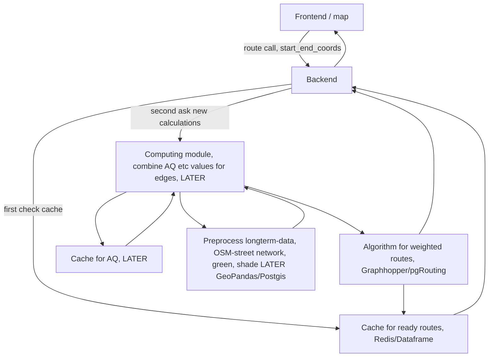

```mermaid

---
config:
  layout: dagre
---
flowchart TB
    A["Frontend / map"] -- route call, start_end_coords --> B["Backend"]
    B -- first check cache --> C["Cache for ready routes, Redis/Dataframe"]
    B -- second ask new calculations --> G["Computing module, combine AQ etc values for edges, LATER"]
    G --> D["Algorithm for weighted routes, Graphhopper/pgRouting"] & F["Cache for AQ, LATER"] & E["Preprocess longterm-data, OSM-street network, green, shade LATER  GeoPandas/Postgis"]
    D --> B & C
    E --> G
    F --> G
    C --> B
    B --> A

```
