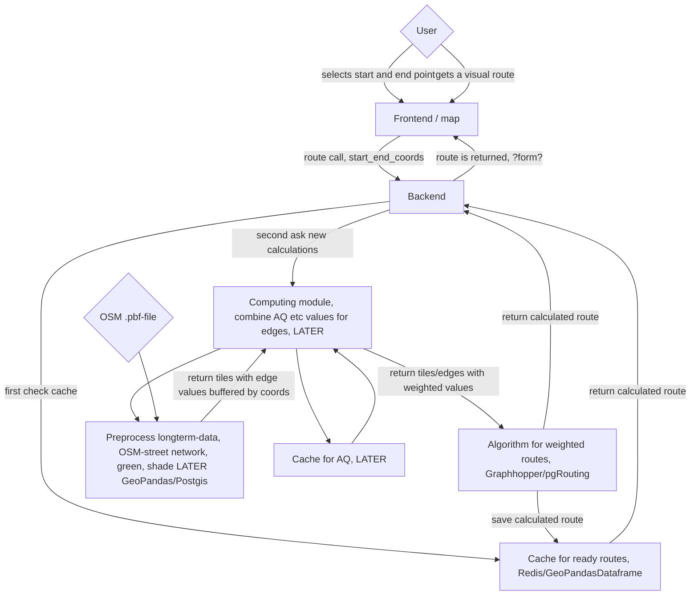

```mermaid

flowchart TB
    I["Frontend / map"] -- route call, start_end_coords --> B["Backend"]
    B -- first check cache --> C["Cache for ready routes, Redis/GeoPandasDataframe"]
    B -- second ask new calculations --> D["Computing module, combine AQ etc values for edges, LATER"]
    D --return tiles/edges with weighted values--> G["Algorithm for weighted routes, Graphhopper/pgRouting"]
    D --> E["Preprocess longterm-data, OSM-street network, green, shade LATER  GeoPandas/Postgis"] & F["Cache for AQ, LATER"]
    G --return calculated route--> B
    G -- save calculated route--> C
    E -- return tiles with edge values buffered by coords --> D
    F --> D
    C -- return calculated route --> B
    H{"OSM .pbf-file"} -->E
    A{"User"} -- selects start and end point--> I
    B --route is returned, ?form?--> I
    A -- gets a visual route --> I

```
